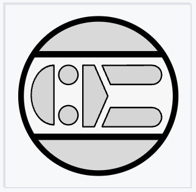
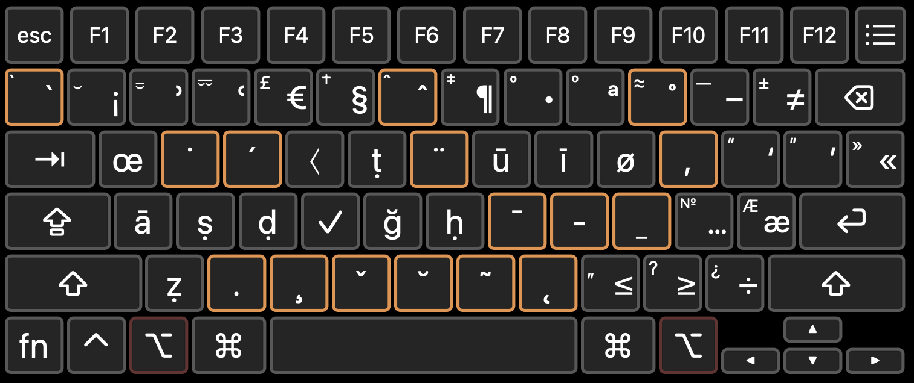

# dawadar-keyboard
A custom keyboard layout for transliterating Middle Eastern languages

## Basic intro

This is a custom keyboard layout to make all the usual symbols and diacritics needed for scholarly transliteration of Arabic, Persian, Turkish, and other Islamicate languages easy to reach.  It allows for quick access to underdots (ṣ, ḍ, ḥ), overdots (ż, ġ), ayn and hamza (ʿ and ʾ), long-vowel macrons (ā, ī, ū), underlines (s̱, ḏ), carons (š, č), and breves above (ğ) and below (ḫ).  Common diacritics in European languages are accessible as well, as are reference markers (§, †, ¶), currencies ($, €, £), quotations (‘’ “” «»), and metrical symbols (⏑, ⏒, ⏔).  It's certainly not comprehensive, and if you need to tweak it to fit your needs, you're welcome to do so.

## Installation
1. Download `Dawadar.bundle`.
2. Open a window in the Finder.
3. Click on the menu "Go" > "Go to Folder…" or just type `Command+Shift+G`.
4. In the dialog box that pops up, type `~/Library/Keyboard Layouts/`.
5. Drag `Dawadar.bundle` into that folder.
6. Restart the computer.
7. Open System Settings > Keyboard > Input Sources. Click the `Edit…` button.
8. You'll see a list of your current keyboard layouts. Click the `+` button in the bottom left corner. 
9. In the dialog box that comes up, within the "English" group, you should see the Dawadar keyboard layout. Add it.

Congratulations, you should now be able to switch to that layout by clicking the keyboard icon on the menu bar, hitting the Globe key 🌐, or some other way.  You usually set this up in your system settings in the keyboard section, but it's a little different depending on your system.  If you're stuck, Google "how do I change my input source for mac" and you should find some helpful instructions.

## Modification
This layout was created with the program [Ukelele](https://software.sil.org/ukelele/).  If you would like to tweak this layout to your own preferences, download the `Dawadar.bundle` and open it with Ukelele.  You should there be able to change anything you like.  It takes a little practice getting used to the program, but it comes with a manual under the Help menu, and there's a [Google group](http://groups.google.com/group/ukelele-users) for additional support.

## Use
The quickest way to familarize yourself with the layout is to click on the input menubar and then select the Keyboard Viewer.  This creates an overlay so you can see exactly what characters your keys will make.  The keyboard works like a normal QWERTY layout until you press and hold the Option key; then, this is what you'll see:

Here are the main features:

- The most common keys you'll need — the long vowels *ā ī ū*, the emphatic *ṣ ḍ ṭ ẓ ḥ*, and the *ʿayn* and *hamza* (`Option+2` and `Option+3`, inspired by [Arabeezi](https://en.wikipedia.org/wiki/Arabic_chat_alphabet) conventions) — are right there and ready to go.
- I also added a check mark because I like checking things off. ✓ 
- If you need additional overdots or underdots, you can press `Option+W` or `Option+X` to activate them (e.g. for ṡ, hit `Option+W`, `s`; this will also work to give you Turkish ı).
- Other common diacritics, like the tilde (ñ), cedilla (ç), caron (š), diaeresis (ü), acute (é), grave (à), circumflex (û), and breve (ḫ), are available on the bottom and top rows.
- You'll find the overstroke, stroke, and understroke in descending order with `Option+J`, `K`, and `L`; this will give you extra macrons (ē), through-strokes (ł), and understrokes (ẕ).
- The inverted commas and guillemets are mapped over the square brackets and backslash.  Hold `Shift` to double or reverse.
- Metrical symbols (very niche, but I use 'em) are `Option+Shift+1`, `2`, and `3` for short (⏑), long (⏒), and overlong (⏔) respectively. (Regular long syllables are usually indicated with a simple en-dash, `Option+hyphen` on this layout.)

Finally, if you hold `Option+Shift` and then hit the diacritic of your choice, it will be pasted on top of the previous character without forming a new glyph.  This is called an "adding" diacritic.  Most of the time they are not useful, insofar that I think it is generally better to use single-glyph Unicode characters whenever possible, since it tends to produce better typography (though perhaps the opposite could be true with certain fonts that don't support Unicode!).  But there is one case where I need this, and that is with the character *s̱*, sometimes used to transliterate ث.  This is not a Unicode character, so instead I first have to type `s`, then `Option+Shift+L` to add the understroke. 

## About the name and icon
The *dawādār* was one among the many specialized occupations within the Mamluk Sultanate.  It literally means "holder of the inkstand" — from the Perso-Arabic compound *dawā(t)* (inkwell) + *dār* (holder) — but in practice it usually meant something like "secretary" or "ajutant," and it was one of the key positions in a sultan's administration (Petry 2022: 70).  Like other professions, it had its own blazon, representing a stylized penbox, which would sometimes be combined with other insignias as powerful officials consolidated multiple roles into their family office.  This icon is adapted from the files kindly provided in the [Mamluk Emblems Online Corpus](https://heraldicart.org/mamluk-emblems-online-corpus/).

<!-- This simple version of the insignia is adapted from Heath 1984 (I know, it's not academic; but hey, it's just an icon).  -->

## History and background
This is a custom keyboard I designed some time ago and have continued to tinker at since.  I finally took the most recent version of these tinkers, gave it a new name and icon, and uploaded it to GitHub for easier updating and distribution.

The original inspiration for this layout came from the [Alt-Latin keyboard](https://www.lib.uchicago.edu/e/collections/mideast/encyclopedia/alt-latin.html), designed in the 2000s by the library staff at the University of Chicago. The layout received a substantial refresh from Theo Beers, which you can download and read about [here](https://medium.com/@tbeers/the-alt-latin-keyboard-layout-windows-version-701c64f8bfd8). A major benefit with Theo's work is that he also prepared a package for Windows, which I haven't bothered to do.  The differences between the two are pretty minimal; I just tweaked it a bit along my personal tastes and needs.

## Further info
This repository contains the keyboard bundle, the `svg` and `icns` files for the icon, a slightly different version of the same, and the example `png` seen above.

I hope this introduction is enough to get you started, but if you need help, please reach out!  I'm happy to take suggestions, too. 

## Version history
- 17 October 2025: Initial commit.

## References
- Petry, Carl F. 2022. *The Mamluk Sultanate: A History.* Cambridge University Press. <https://doi.org/10.1017/9781108557382>.

<!-- - Heath, Ian. 1984. *Armies of the Middle Ages, Volume 2: The Ottoman Empire, Eastern Europe and the Near East, 1300-1500*. Goring-by-Sea, Sussex: Wargames Research Group. -->
